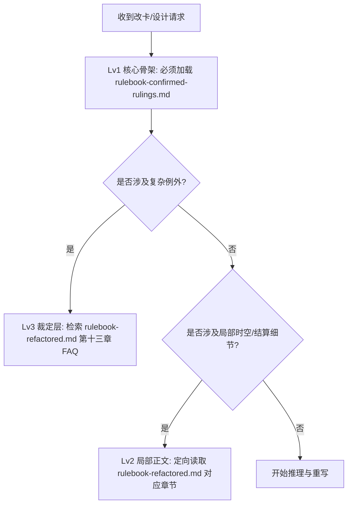

# Skill: 五行卡牌规则按需理解与语言规范

此技能定义了后续 Agent（包括本 Agent）在开发、修改和评估卡牌时，如何以最节省 context 且最精确的方式分级检索桌游规则，以及中英文术语的转化规范。

## 1. 规则的分级按需检索机制 (RAG 策略)

为了避免将 50KB 的重构规则书一并塞入 context 导致 Token 爆仓或注意力失焦，Agent 在工作时必须遵循以下 **3 级按需检索模型**：

-   **Lv1 核心骨架 (全局必读)**：
    -   文件：[rulebook-confirmed-rulings.md](file:///d:/workspace/wuxia-card-agent/docs/rulebook-confirmed-rulings.md)
    -   时机：启动改卡评审或设计新特技时，**必须首先读取该文件**，以获得作者确认过的核心游戏概念边界。
-   **术语理解层 (按术语触发)**：
    -   文件：`data/review/rule_terms.json`、`docs/rule-terms-understanding.md`
    -   时机：请求涉及学会、学习、复制、模拟、获得特技、完美学会、完美复制，或特技文本中写有原人物名字时，必须读取。
    -   目的：补足规则书尚未完整展开的作者术语解释，避免把普通学会误判为完美适配自身。
-   **Lv2 局部细节 (按需定向读取)**：
    -   文件：[rulebook-refactored.md](file:///d:/workspace/wuxia-card-agent/docs/rulebook-refactored.md) 的特定章节
    -   时机：仅当卡牌涉及具体的复杂机制时，才通过 line-range 或 grep_search 定向读取对应章节。例如：
        -   涉及隐形、布阵、破空 $\rightarrow$ 仅读 **第四章：时空、在场与定位机制**。
        -   涉及结算优先级、不中、无效 $\rightarrow$ 仅读 **第九章：特技结算顺序与优先级队列**。
        -   涉及死亡、免死、共享生命 $\rightarrow$ 仅读 **第七章：防御系统 / 第一章：卡牌容器**。
-   **Lv3 裁定FAQ (冲突检索)**：
    -   文件：[rulebook-refactored.md](file:///d:/workspace/wuxia-card-agent/docs/rulebook-refactored.md) 第十三章 (FAQ/历史裁定案例集)
    -   时机：当面对被抹去、改字等极度破坏规则的特技，或者李沉舟、步惊云等高优先级例外卡牌时，定向检索此章。

## 2. 语言规范：内部英文推导，输出全中文规则

-   **内部推理与代码逻辑 (中 $\rightarrow$ 英)**：
    -   为了保证逻辑判断的严密性和变量命名的一致性，Agent 在写内部代码（如后端 SQL、前端 JS）、数据模型（JSON）和在思索（Thinking）中进行逻辑链推导时，**支持并推荐使用清晰的英文术语**进行命名和映射。
    -   标准术语映射表：
        -   回合 $\rightarrow$ `Turn`
        -   轮 $\rightarrow$ `Round`
        -   转轮 $\rightarrow$ `Cycle`
        -   在场 $\rightarrow$ `Active`
        -   不在场 $\rightarrow$ `Inactive`
        -   破空 $\rightarrow$ `Void`
        -   离场 $\rightarrow$ `Left`
        -   找不到 $\rightarrow$ `Untargetable`
        -   生命流失 $\rightarrow$ `LifeLoss`
        -   弃牌堆 $\rightarrow$ `DiscardPile`
        -   除外区 (本局弃卡) $\rightarrow$ `RemovedFromGame`
        -   人物单元 $\rightarrow$ `Unit`
        -   物理卡牌 $\rightarrow$ `Card`
-   **输出与规则重写 (英 $\rightarrow$ 中，零英文)**：
    -   当 Agent **输出最终的卡牌新文案、重新编译生成规则书或向用户回复文案时，必须保持纯粹的中文环境**。
    -   **禁忌**：禁止在最终规则书或卡牌描述中包含任何英文术语（如不能在特技描述里写 "Round 结束"、"Unit 死亡" 等，必须严格翻译为对应的 "轮结束"、"单元死亡"）。保证玩家最纯粹的武侠沉浸感。
