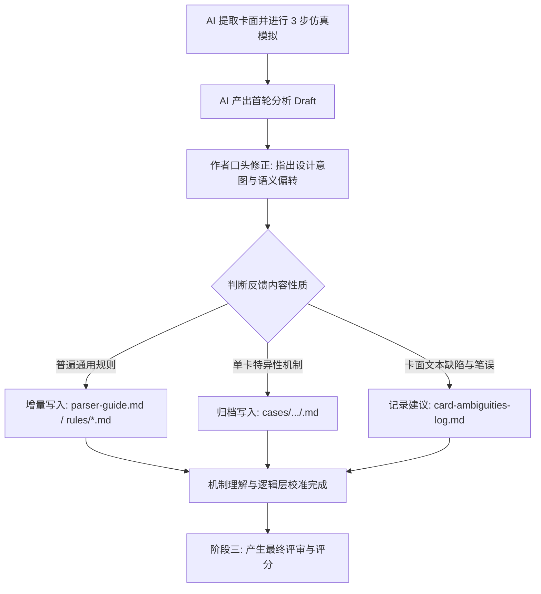

# 五行卡牌：卡牌理解与人机反馈校准工作流 (Card Calibration Workflow v2.0)

本工作流为作者与 AI 共同沉淀的**核心工程规程**。旨在通过不厌其烦的单卡深拆与双向对齐，消除 AI 对自然语言描述的盲目臆断，建立对复杂博弈机制的精确映射，最终产生高质量、无偏误的卡牌评分与审计报告。

> [!IMPORTANT]
> **严禁进行未经逐一校准的 AI 批量卡牌评价/评分！** 
> 任何单卡的打分与评估，必须先经过本工作流的单卡解析与人机对齐，严禁跳过中间环节。

---

## 阶段一：单卡逻辑解构与人机对齐三步走 (Hierarchical Alignment Steps)

在分析任何新人物卡时，AI 必须严格执行以下时序步骤，严禁直接跨越进行数学计算或强行打分：

### 1. 卡面事实与基础规则检索 (Rule Retrieval)
* 从 SQLite 数据库读取该人物卡的生命、兵器与所有特技文本。
* 检索相关的基础游戏规则（如：每个人物拥有一整套 8 张基础手牌，非盲抽）。

### 2. 特技逐条定性理解汇报 (Qualitative Deconstruction - 核心必须优先执行)
AI 必须向作者列出该人物每一条特技在规则层面的**定性理解**，包括：
* 该特技的触发条件、生效时点（是否是正面出战回合、还是侧面场下）。
* 动作主语语义指代（“自身”指代谁）。
* 伤害属性（是常规伤害、一定造成，还是生命流失；是否抹去原有攻击）。
* **AI 必须暂停在此处，等待作者的口头裁定与核对。在作者确认所有特技定性理解“完全正确”前，严禁开展任何数值期望、存活回合和博弈矩阵的计算！**

### 3. 定量数学仿真演算 (Quantitative Simulation - 作者确认后执行)
在特技理解完全对齐后，AI 方可执行以下定量模拟，并记录至已校准数据统计表 [calibrated_stats.json](file:///d:/workspace/wuxia-card-agent/data/review/calibrated_stats.json)：
* **正面攻击期望 (attack_expectation_frontal)**：根据 8 张基础牌的主动出牌博弈，计算不同决策下的伤害期望。
* **穿透率 (penetration_rate)**：计算一定造成/破防/无法抵挡的输出占比。
* **等效正面存活回合数 (frontal_survival_turns)**：模拟在面对 400、600、800、1000 等常规输出下，结合减免与护盾的实际存活回合数。
* **侧面防御能力 (side_defense) 与侧面输出期望 (side_output_expectation)**。
* **纳什均衡博弈矩阵**：如果有博弈决策（如一阳指 vs 木水防守），画出具体的收益矩阵。

---

## 阶段二：人机反馈与增量写入循环 (Bidirectional Feedback Loop)

AI 生成首轮分析报告后，必须与作者执行双向校准：

### 增量写入规范：
* **通用规则**（如“无法抵挡导致不能反射”）：写入 `parser-guide.md`，作为后续所有卡牌的通用物理准则。
* **单卡案例**（如邀月的明玉功 4 次结算）：写入 `cases/`，作为后续横向检索的“结论可迁移锚点”。
* **卡面文案漏洞**（如怜星宫主中“自身”的歧义）：写入 `card-ambiguities-log.md`，记录 drop-in 式重写建议。

---

## 阶段三：正式评价与评分产出 (Formal Evaluation)

只有在阶段二完成、AI 的语义和数学模型被作者“口头裁决”确认无误后，AI 才能生成最终的评价输出，并登记进已评估卡牌的对比参照库：

### 1. 登记至已校准数据统计表 (Registering Stats)
向 **[data/review/calibrated_stats.json](file:///d:/workspace/wuxia-card-agent/data/review/calibrated_stats.json)** 中登记以下五个核心对账维度，用于未来同类卡牌的相对横向对比和存活率推算：
* **正面攻击期望 (attack_expectation_frontal)**：该角色在正面对战中，期望能制造出多高的输出（允许使用条件区间、公式或区间估值进行描述）。
* **穿透率 (penetration_rate)**：该角色造成的输出中，“一定造成”、“破防（破）”或“无法抵挡（无视闪避）”等具有顶层穿透性伤害的占比有多高。
* **正面存活期望回合数 (frontal_survival_rounds)**：在面对常规 400 点名义输出的白人对手时，该角色在正面对战中等效能支撑多少回合（结合减免、反射和治疗得出）。
* **侧面防御能力 (side_defense)**：该角色处于场下（侧面非对阵状态）看着别人作战时，自身抵御全场波及伤害、即死或异常状态的防御层级与机制。
* **侧面输出期望 (side_output_expectation)**：该角色在场下（侧面非对阵状态）时，期望能对战场造成多高的伤害或流失输出（侧面与正面输出逻辑完全不同，需独立计算）。

### 2. 更新成果文件 (Updating Output Files)
1. **更新单卡人类可读笔记**：在 `data/review/card_notes/<卡名>.md` 中生成包含完整正面生存、侧面生存、优点、缺点、规则风险和电子化风险的最终报告。
2. **更新评语层数据库**：向 `data/review/card_evaluations.json` 中写入基于最新校准结论的脱水文字与分析数值。
3. **沉淀理解笔记**：更新 `data/review/card_understanding_notes.json`，完成对该卡的最终机制锁定。

