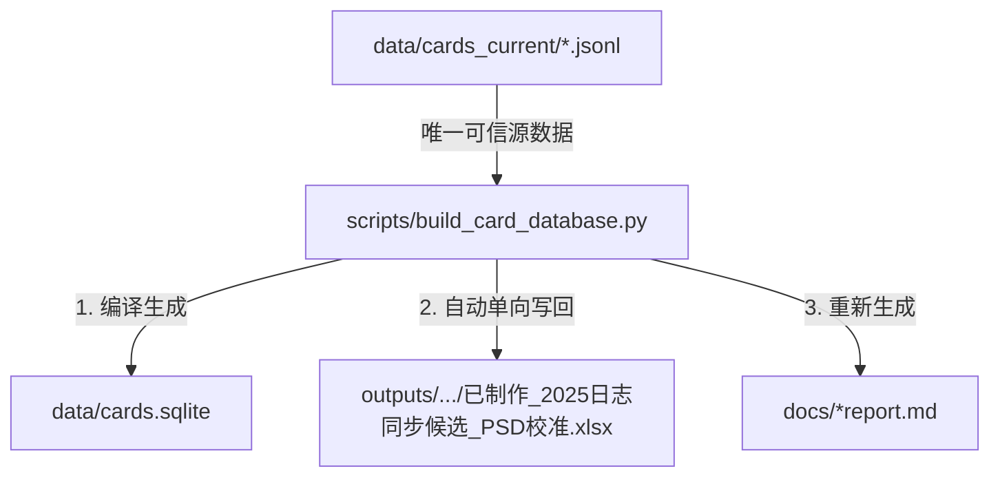

# Skill: 五行卡牌数据源与编译架构

本篇文档详细介绍了五行卡牌项目的**数据源管理**、**编译流程**与**同步机制**。开发与维护卡牌数据时必须遵循此架构。

---

## 1. 核心架构：数据库优先 (Database-First / JSONL-First)

自 3.07 版本起，项目的数据源模型从原来的“Excel 优先（正则解析）”彻底重构为**“数据库优先 / JSONL 优先”**模式：

* **唯一可信数据源 (Source of Truth)**：`data/cards_current/` 目录下的 JSONL 文件（如 `combat_characters.jsonl`、`attached_characters.jsonl` 等）。
  * 所有的卡牌字段和特技数据（如特技名称、类别 `kind`、所属人物 `owner_units`）在 JSONL 的 `abilities` 字段中以结构化形式持久化存储。
  * 特技分类（例如将“保定帝”、“大理段二”、“避位为僧”和“六脉神剑经”设为“字”）已直接固化在 JSONL 文件中，无需外部补丁文件在编译时进行纠偏。
* **衍生镜像 (Derived Mirror)**：
  * **Excel 文件** (`已制作_2025日志同步候选_PSD校准.xlsx`)：不再作为主数据源。每次运行编译时，编译脚本会把 JSONL 中的最新数据自动写回并覆盖 Excel，用于对齐 PSD 印制。
  * **SQLite 数据库** (`data/cards.sqlite`)：直接由 JSONL 编译生成，仅作为卡牌浏览器端的高效只读查询库。

---

## 2. 数据流向与编译命令



### 日常编译与同步 (JSONL -> SQLite & Excel)
当修改了 JSONL 文件或新增卡牌后，运行以下命令：
```powershell
python scripts/build_card_database.py
```
* **效果**：重新生成 SQLite 数据库，并**自动将最新数据写回/更新 Excel**。同时清理 Excel 中超出的空行和格式，保持两者 100% 同步。

### 逆向导入 (Excel -> JSONL) - 应急备份
如果您手动修改了 Excel（例如修改了卡面描述或数值）并希望强制将其同步回 JSONL 源数据中，请运行：
```powershell
python scripts/build_card_database.py --import-excel
```
* **效果**：脚本会先从 Excel 重新运行正则解析、应用既有 overrides 补丁并将解析后的结构化数据写入 JSONL，然后再常态化执行数据库编译。

---

## 3. 人工/AI 维护原则

1. **改卡与新增**：
   * 必须直接修改 `data/cards_current/` 下的对应 JSONL 文件（或交由 AI Agent 结构化写入）。
   * 不要手动去修改 Excel，因为下一次编译时 Excel 就会被 JSONL 数据直接覆盖。
2. **特技分类与属性（如“字”类型的维护）**：
   * 特技分类已融入 JSONL 中。如果某特技需要修改为 `“字”` 或是指定多人卡的所属 Unit，直接在 JSONL 中修改该特技的 `kind` 和 `owner_units` 字段。
   * `author_ability_overrides.json`、`card_field_overrides.json` 等“动态补丁层”已被废弃，不要往里面添加新卡规则。
3. **物理编号 (source_row)**：
   * `source_row` 规范化为从 1 开始的顺序索引（等于 Excel 行号 - 1）。在网页端呈现的位置（如 `战斗人物!1`）即代表卡牌的物理编号。
