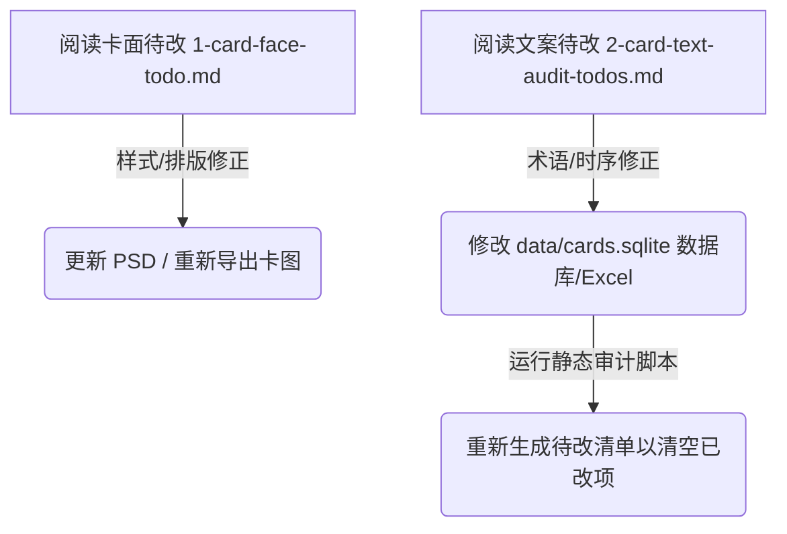

# 📂 五行卡牌数据与规则书审计报告导航（作者专页）

为了方便您一目了然地审阅、修改所有的卡牌和规则内容，我们在此文件夹中为您归纳了所有生成的审计待办和诊断报告。

您在后续的修订工作中，**只需关注并在此处查看以下文件即可**：

---

## 🧭 阅读与修改导航

### 📂 1. [卡面排版与物理待改清单](file:///d:/workspace/wuxia-card-agent/reports/1-card-face-todo.md)
*   **用途**：记录了 PSD 牌面图、多人一卡或 release 导出图片中的**分行、缩进、加粗、缺冒号**等排版样式待改项。
*   **如何修改**：这是纯物理卡面样式的待改清单。您可以在后续修改 PSD 和生成更新说明时参考此项。
*   **典型案例**：赵德言的 `归魂十八爪` 姿态缩进、狄云 `连城剑法` 的冒号补齐等。

### 📂 2. [卡牌文案时序与术语审计待改清单](file:///d:/workspace/wuxia-card-agent/reports/2-card-text-audit-todos.md)
*   **用途**：基于最新的五行规则书标准底座，自动筛查出的 **368 张** 嫌疑卡牌问题清单（按原著小说归类排版）。
*   **如何修改**：这些主要是时机模糊或术语冲突。您可以在有空修改 SQLite 数据库或 JSONL 时，对照此文件的报警信息（例如：“血量”改为“生命值”、“缺时机限制词”）进行文案的规范化。
*   **典型案例**：卫宫切嗣的溢出伤害“血量”改为“生命值”，并为狙击步枪增加明确触发时机等。

### 📂 3. [规则书自动化比对强校验报告](file:///d:/workspace/wuxia-card-agent/reports/3-rulebook-discrepancy-report.md)
*   **用途**：用于强行核对重构优化版的规则书是否 100% 精确承袭了原规则书的 14 个核心结算优先级顺位，且没有漏掉任何规则条款。
*   **当前状态**：**已完全通过强校验 (全绿)**，结算顺序与 533 条规则条款包含度完美一致，已同步自动编译生成了排版精美的 `五行卡牌规则.docx`！

---

## 🛠️ 卡牌及规则修改推荐流程



- **静态审计重新扫描指令**（在您修改了数据库，想要重新验证时，运行以下命令即可）：
  ```powershell
  python scripts/audit_cards.py
  ```
  *(运行后，`reports/2-card-text-audit-todos.md` 将根据最新的数据库内容自动更新，已改完的卡牌将自动被剔除。)*
